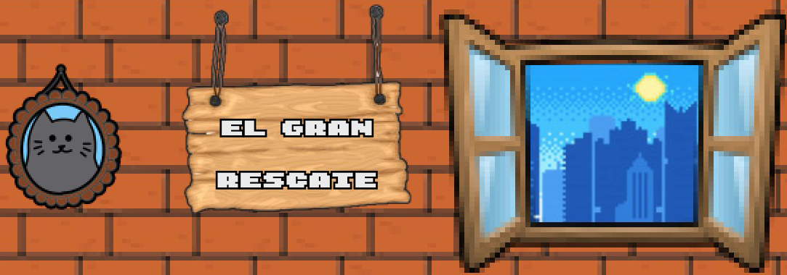

# <b>El Gran Rescate</b>
El gran rescate es un videojuego en el que controlamos a un gato que va en busca de su madre, el cual fue sustraída de su hogar. Durante el juego el gato tendrá que recorrer la ciudad enfrentándose a enemigos que trataran de obstaculizar el rescate de su madre.
 

## <b>Captura de Pantallas</b>

## <b>¿Como se hizo?</b>

-Propuesta de Idea: 
  https://www.youtube.com/embed/4e8jeXlmq2c 
-Versión Temprana del Juego: 
  https://www.youtube.com/watch?v=WAiPXDELVz8 
  
## <b>Corto</b>
https://youtu.be/jxBWxjx4qYU
  
## <b>Requisitos del Sistema</b>
- SO: Windows 7 o Superior
- Memoria: 4GB de Ram o Más
- Video: Intel HD3000 o superior
- Espacio: 100MB

## <b>Creditos</b>
  - [Unity] (https://unity.com/es) Motor de Videojuego.
  - [Adobe Photoshop] (https://www.adobe.com/products/photoshop.html) Herramienta de Edición de Imagen.
  - [Adobe AfterEffects] (https://www.adobe.com/products/aftereffects.html) Herramienta de Animacion.
  - [Piskel] (https://www.piskelapp.com/) Pagina de Creacion pixel art.
